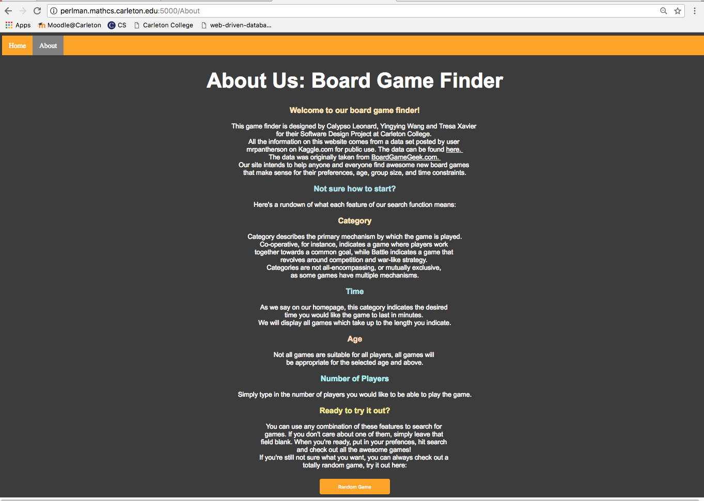
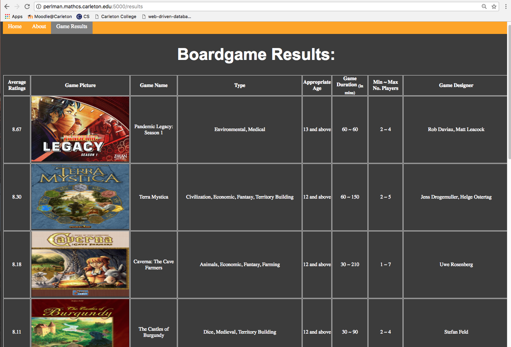
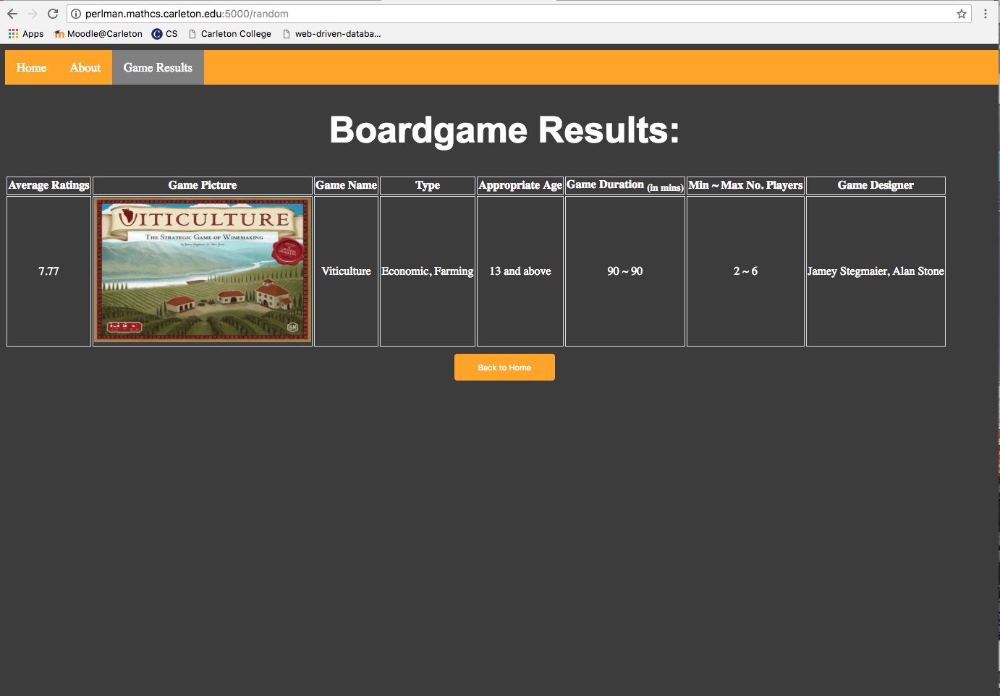

# Board Game Finder

Our project is currently a fully functional web app which accepts up to four criteria and searches a large database to 
return a set of board games which fit the input requirements. Users can search on the basis of the number of players, length
of play, type of gameplay, and suitable age, or using any combination of these.
## Run this app:
###### Dependencies
* python3
* [PostgreSQL](https://www.postgresql.org/)
* [psycopg2](http://initd.org/psycopg/) module in python3
* [Flask](http://flask.pocoo.org)
###### Load the Board Game database into postgresql 
To create a new database table, run the command (no need to create again later if there's existing database table)
```
$ psql -f createtable.sql
```
You will need to enter your database password when prompted.

Then run
```
$ psql
```
to enter the "interpreter"

Type
```
\dt
```
at the prompt. You should see your table in the database.

Import data
```
\copy boardgames FROM 'boardGame.csv' DELIMITER ',' CSV
```

Quit with command
```
\q
```

###### Change configuration in datasource.py
* Edit datasource.py and update the database/user/password to new postgresql info.
* Ensure that the permissions on datasource.py allow execution

##### Run the user interface
```
$ python3 boardGameFinderAPI.py localhost 5000
```
Now, when you run the app, you should see:
```
Running on http://localhost:5000/ (Press CTRL+C to quit)
```
Navigate to the URL indicated in the console


## Features:
* A homepage with a set of drop-down menus and a bar which only accepts numbers as input which allows the user
to input their preferences.
* A results page which shows users 10 games which relevant information such as name, number of players, and category,
as well as a photo of the game's cover art.
* A random-game selector which displays data for a random game in top 100 ranked games.
* An About page, which describes in greater detail what each criterion entails.

## Files in this repository:
###### This repo contains code for the database-driven web project. It consists of the following files:
* createtable.sql: A Python script used to create a database and set up the table(s), including table columns and types.
* boardGames.csv: A comma-space delimited text file containing data on 5000 board games from the website boardgamegeek.com. We retrieved this [data](https://www.kaggle.com/mrpantherson/board-game-data) from a user's post on Kaggle.com, on which it is listed as available for projects. 
* [web project D] Project Plan Assignment.pdf: A pdf file outlining the initial goals and format of our project.
* boardGameFinderAPI.py: A Python script which transmits search information from the HTML to our SQL queries using Flask.
* datasource.py: A Python script which creates strings for SQL queries based on which criteria are selected by the user.

###### Templates folder:
* index.html: An HTML file of the homepage for our web app, which allows users to input specific criteria to search the 
database for different board games
* results.html: An HTML file which displays the game data retrieved from the SQL query.
* noResults.html: An HTML file which displays no result found with chosen criteria to the user 
* about.html: An HTML file which displays the purpose of this game finder and explains how it works

###### Static folder:
* prelim.css: A css file containing the styling basis for our web app.

## Author:
* Yingying Wang
* Calypso Leonard
* Tresa Xavier

## Screenshots:
##### Home Page:

##### About Page:

##### Selecting Criteria from drop-down boxes:

##### Game Results:

##### Random Game:

